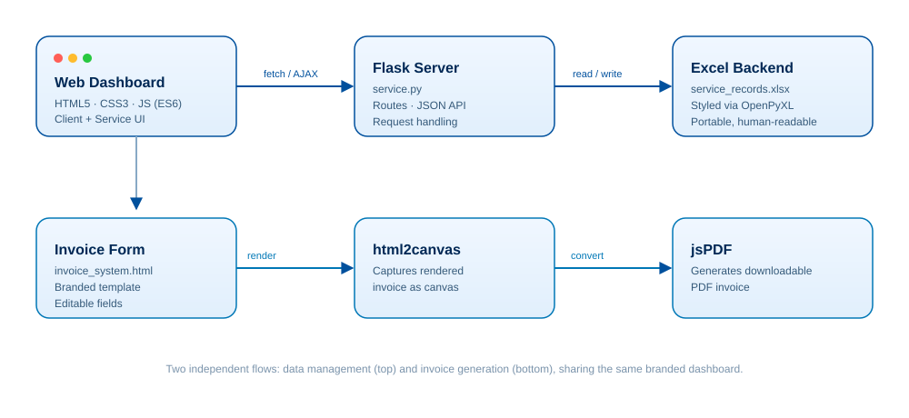

<div align="center">
  

  <p>
    
    
    
    
    
  </p>
</div>

## What is this?

**HydroManager** is a lightweight, self-hostable CRM for small service businesses — built with pool service companies in mind, but easily rebranded for any field-service trade (lawn care, HVAC, cleaning, etc.).

Instead of a heavy database, it stores everything in a single, well-formatted **Excel file** that stays readable and editable even outside the app. On top of that, it layers a **Flask web dashboard** for managing clients and service history, plus an **in-browser invoice generator** that turns a form into a polished, downloadable PDF.

No database server, no complicated setup — just Python, one dependency, and a spreadsheet.

## Architecture



## Features

| | |
|---|---|
| 🧑‍🤝‍🧑 **Client Management** | Add, edit, or remove client profiles and service locations from the dashboard. |
| 🧰 **Service Logging** | Track technician visits, monthly pricing, and chemical usage per client. |
| 📊 **Excel-Native Backend** | Records live in a structured `.xlsx` file — open it directly in Excel/Sheets any time. |
| 🧾 **Professional Invoicing** | Fill in a web form and export a formatted PDF invoice using `html2canvas` + `jsPDF`. |
| 💳 **Payment Status Tracking** | Visual badges for **Paid**, **Partial**, and **Unpaid** accounts. |
| 🎨 **Rebrandable** | Swap the app name, colors, and logo in a couple of places — ships with placeholders, not hardcoded branding. |

## Tech stack

- **Backend:** Python 3, Flask
- **Data layer:** OpenPyXL (styled `.xlsx` read/write, no external DB)
- **Frontend:** HTML5, CSS3, vanilla JavaScript (ES6)
- **PDF export:** jsPDF, html2canvas

## Project structure

```
HydroManager-Pool-Service-Invoice-System/
├── service.py            # Flask app — routes, Excel helpers, server entrypoint
├── invoice_system.html   # Standalone branded invoice template
└── assets/                # README banner & diagram assets
```

## Getting started

**Requirements:** Python 3.8+

```bash
# 1. Clone the repository
git clone https://github.com/YehenSilva/HydroManager-Pool-Service-Invoice-System.git
cd HydroManager-Pool-Service-Invoice-System

# 2. Install dependencies
pip install flask openpyxl

# 3. Run the app
python service.py
```

Then open **http://localhost:5050** in your browser. On first run, `service.py` automatically creates `service_records.xlsx` with the correct headers and styling — no manual setup required.

## Rebranding

`service.py` exposes a small config block at the top of the file:

```python
APP_NAME = "HydroManager"
EXCEL_FILE = "service_records.xlsx"
DEFAULT_PERSONS = ['Staff A', 'Staff B', 'Staff C']
```

Change `APP_NAME` and the dashboard title updates automatically. Swap the placeholder fields in `invoice_system.html` (`COMPANY NAME`, address, bank details) with your own business info to produce client-ready invoices.

## Roadmap ideas

- [ ] Authentication for multi-technician access
- [ ] Recurring service scheduling
- [ ] Export monthly summaries straight from the dashboard
- [ ] Optional SQLite backend for larger client lists

## License

Released under the [MIT License](LICENSE).

---

<div align="center">
  <sub>Built for small service teams who'd rather spend time in the field than in spreadsheets.</sub>
</div>
